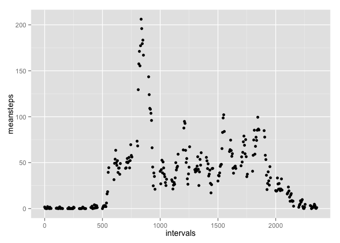

# Reproducible Research: Peer Assessment 1
## Loading and preprocessing the data
* Load the data

```r
activity<-read.table("activity.csv",sep=",",header=TRUE)
```

## What is mean total number of steps taken per day?
* Histogram of total steps per day

```r
library(dplyr)
```

```
## 
## Attaching package: 'dplyr'
## 
## The following objects are masked from 'package:stats':
## 
##     filter, lag
## 
## The following objects are masked from 'package:base':
## 
##     intersect, setdiff, setequal, union
```

```r
library(ggplot2)
days<-group_by(activity,date)
sumsteps<-summarize(days,totalsteps=sum(steps,na.rm=TRUE))
qplot(date,totalsteps,data=sumsteps,geom="bar",stat="identity",xlab="day")
```

 

* Mean and median steps per day

```r
meansteps<-summarize(days,meansteps=mean(steps,na.rm=TRUE))
mediansteps<-summarize(days,mediansteps=median(steps,na.rm=TRUE))
print(meansteps)
```

```
## Source: local data frame [61 x 2]
## 
##          date meansteps
## 1  2012-10-01       NaN
## 2  2012-10-02   0.43750
## 3  2012-10-03  39.41667
## 4  2012-10-04  42.06944
## 5  2012-10-05  46.15972
## 6  2012-10-06  53.54167
## 7  2012-10-07  38.24653
## 8  2012-10-08       NaN
## 9  2012-10-09  44.48264
## 10 2012-10-10  34.37500
## ..        ...       ...
```

```r
print(mediansteps)
```

```
## Source: local data frame [61 x 2]
## 
##          date mediansteps
## 1  2012-10-01          NA
## 2  2012-10-02           0
## 3  2012-10-03           0
## 4  2012-10-04           0
## 5  2012-10-05           0
## 6  2012-10-06           0
## 7  2012-10-07           0
## 8  2012-10-08          NA
## 9  2012-10-09           0
## 10 2012-10-10           0
## ..        ...         ...
```

## What is the average daily activity pattern?
* Time series plot of 5-min interval and average stpes across all days

```r
intervals<-group_by(activity,interval)
avesteps<-summarize(intervals,meansteps=mean(steps,na.rm=TRUE))
qplot(interval,meansteps,data=avesteps,type="l",stat="identity",xlab="intervals")
```

 

* The 5-min interval that has max mean steps

```r
avestep<-avesteps[,"meansteps"]
maxmean<-max(avestep,na.rm=TRUE)
print(maxmean)
```

```
## [1] 206.1698
```

## Imputing missing values
* Total number of missing values

```r
checkNA<-is.na(days$steps)
i<-0
for (j in seq_along(checkNA)){
  if (checkNA[j]==TRUE){
    i<-i+1
  }
}
print(i)
```

```
## [1] 2304
```
* Filling missing data

```r
filldays<-days
for (i in seq_len(nrow(filldays))){
  if (is.na(filldays[i,"steps"])==TRUE){
    interval1<-filldays[i,"interval"]
    for (j in seq_len(nrow(avesteps))){
      if (avesteps[j,"interval"]==interval1){
        filldata<-avesteps[j,"meansteps"]
      }
    }
    filldays[i,"steps"]<-filldata
  }
}
```
* Histogram of total steps per day with filling data

```r
days2<-group_by(filldays,date)
sumsteps2<-summarize(days2,totalsteps2=sum(steps,na.rm=TRUE))
qplot(date,totalsteps2,data=sumsteps2,geom="bar",stat="identity",xlab="day")
```

 

* Mean and median steps per day with filling data

```r
meansteps2<-summarize(days2,meansteps2=mean(steps,na.rm=TRUE))
mediansteps2<-summarize(days2,mediansteps2=median(steps,na.rm=TRUE))
print(meansteps2)
```

```
## Source: local data frame [61 x 2]
## 
##          date meansteps2
## 1  2012-10-01   37.38260
## 2  2012-10-02    0.43750
## 3  2012-10-03   39.41667
## 4  2012-10-04   42.06944
## 5  2012-10-05   46.15972
## 6  2012-10-06   53.54167
## 7  2012-10-07   38.24653
## 8  2012-10-08   37.38260
## 9  2012-10-09   44.48264
## 10 2012-10-10   34.37500
## ..        ...        ...
```

```r
print(mediansteps2)
```

```
## Source: local data frame [61 x 2]
## 
##          date mediansteps2
## 1  2012-10-01     34.11321
## 2  2012-10-02      0.00000
## 3  2012-10-03      0.00000
## 4  2012-10-04      0.00000
## 5  2012-10-05      0.00000
## 6  2012-10-06      0.00000
## 7  2012-10-07      0.00000
## 8  2012-10-08     34.11321
## 9  2012-10-09      0.00000
## 10 2012-10-10      0.00000
## ..        ...          ...
```
## Are there differences in activity patterns between weekdays and weekends?
* Difference of activity patterns between weekdays and weekends

```r
library(lubridate)
week<-mutate(filldays,week=wday(date,label=TRUE))
weekends<-filter(week,week>"Fri")
weekends<-mutate(weekends,wday="Weekends")
weekdays<-filter(week,week<"Sat")
weekdays<-mutate(weekdays,wday="Weekdays")
withweek<-rbind(weekdays,weekends)
intervals3<-group_by(weekends,interval)
avesteps2<-summarize(intervals3,meansteps=mean(steps,na.rm=TRUE))
intervals4<-group_by(weekdays,interval)
avesteps3<-summarize(intervals4,meansteps=mean(steps,na.rm=TRUE))
par(mfrow=c(1,2))
with(avesteps2,{
  plot(interval,meansteps,type="l",xlab="Weekends")
})
with(avesteps3,{
  plot(interval,meansteps,type="l",xlab="Weekdays")
})
```

 
